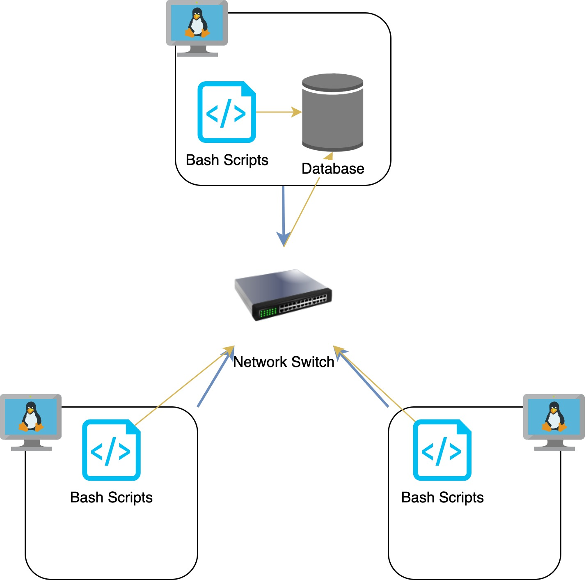

# Linux Cluster Monitoring Agent
## Introduction
The Jarvis Linux Cluster Administration (LCA) team manages a Linux cluster of 10 nodes/servers which are running CentOS 7. These servers are internally connected through a switch and able to communicate through internal IPv4 addresses. The LCA team needs to record the hardware specifications of each node and monitor node resource usages (e.g. CPU/Memory) in realtime (see appendix A). The collected data should be stored in an RDBMS database. LCA team will use the data to generate some reports for future resource planning purposes (e.g. add/remove servers). This project aims to develop a MVP to help the LCA team collect/store hardware specifications and monitor server resource usage.
##Architecture and Design


_Figure 1: Architecture overview for 3 nodes_

## Database & Tables
The database in use is "host_agent" which has two tables, named, "host_info" and "host_usage". PostgreSQL instance is used to collect and store all requried data.

- `host_info`: This table is used to store the required hardware specifications.
  - `id`: Unique id number corresponding to each node, is a primary key in the table and is auto-incremented by PostgreSQL.
  - `hostname`: Unique constraint field for hostname.
  - `cpu_number`: Number of existing CPU cores.
  - `cpu_architecture`: CPU architecture using `lscpu`.
  - `cpu_model`: Name of CPU model.
  - `cpu_mhz`: Clock speed of the processor.
  - `l2_cache`: L2 cache size measure typically in kB. Convert to human readable form.
  - `total_mem`: Total memory in current node/server.
  - `timestamp`: The UTC timestamp of data collection.

- `host_usage`: This table holds node/server resource usage data.

  -`timestamp`: The UTC timestamp of data collection.
  - `host_id`: The id of the current server/node. This is the foreign key of the table.
  - `cpu_number`: Number of existing CPU cores.
  - `memory_free`: This is the idle memory size.
  - `cpu_idle`: The percentage of time in which the CPU remains idle.
  - `cpu_kernel`: The percentage of time in which the CPU is running.
  - `L2_cache`: L2 cache size memory typically measured in kB. Convert to human readable form.
  - `disk_io`: Current input/output operations.
  - `disk_available`: Available disk space. 


## Script Descriptions
- `host_info.sh`: Extracts required hardware specifications and inserts it into database.
- `host_usage.sh`: Extracts current host resource usage and inserts it into the database.
- `psql_docker.sh`: Start/stop docker PostgreSQL container. Start docker if necessary.
- `psql_ddl.sql`: Automates the creating of `host_agent` database and the `host_info` and`host_usage` tables when necessary.
- `queries.sql`: Contains the following 2 SQL queries to help user track the cluster.
  - Group nodes/servers by "cpu_number" and "total_mem".
  - Find average memory used over a 5 minute interval.

## Usage
- **Database and Table Initialization**: Start the docker instance. The docker instance "psql_docker.sh" will be used to start/stop instance.
```Bash
#Povision and start postgreSQL instance with docker
/.linux_sql/scripts/psql_docker.sh start db_password

#Initialize the database and tables
psql -h localhost -U postgres -W -f sql/ddl.sql
```

- **host_info.sh**: Insert `host_info` data into `host_info` table.
```Bash
./linux_sql/scripts/host_info.sh psql_host psql_port db_name psql_user psql_password
```

- **host_usage.sh**: Insert `host_usage` data into `host_usage` tale.
```Bash
./linux_sql/scripts/host_usage.sh psql_host psql_port db_name psql_user psql_password
```

- **crontab setup**: Setting crontab job to extract `host_usage~` data to update as required.
```Bash
#edit crontab jobs
bash> crontab -e

#add this to crontab
* * * * * bash /home/centos/dev/jrvs/bootcamp/linux_sql/host_agent/scripts/host_usage.sh localhost 5432 host_agent postgres password > /tmp/host_usage.log

#list crontab jobs
crontab -l
```
## Improvements

- The assumption made in the current scenario is static hardware specification. This could be improvised with a script to handle dynamic hardware specifications.
- `host_usage` data can grow huge and cause memory depletion. Unnecessary data can be filtered.
